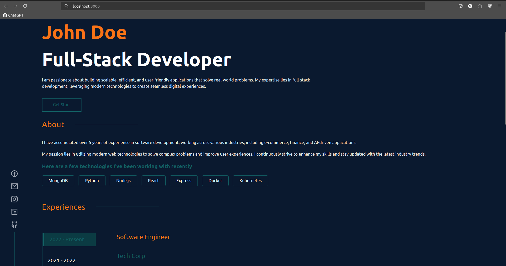
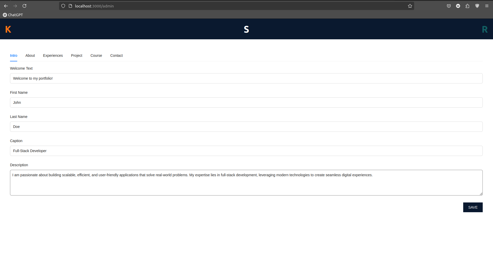

# Portfolio Website

## Table of Contents
- [Introduction](#introduction)
- [Technologies](#technologies)
- [Getting Started](#getting-started)
- [Some Demo Image](#some-demo-image)


## Introduction

This is a Portfolio Website built using Node.js, Express, MongoDB, and React. It allows users to manage and update portfolio content dynamically. All changes are stored in a MongoDB database, ensuring that the portfolio remains up to date with the latest modifications.

With this project, you can:

  - Showcase your projects, skills, and experiences.
  - Modify portfolio data through an admin interface.
  - Store and retrieve data from a database for a seamless experience.

## Technologies

Frontend:

  - React.js – For building a dynamic and responsive user interface.
  - React Router – For client-side navigation.
  - Axios – For making API requests.

Backend:

  - Node.js – A JavaScript runtime for server-side logic.
  - Express.js – A lightweight framework for handling API requests.
  - MongoDB Atlas – A cloud-based NoSQL database for storing portfolio data.
  - Mongoose – An ODM library for managing MongoDB data models.

## Getting Started

1. Clone the repository:
    ```bash
    git clone https://github.com/hunglk25/Portfolio_Website.git
    ```

2. Navigate to the project directory:
    ```bash
    cd Portfolio_Website
    ```
3. Modify the .env

4. Download dependencies
    ```bash
    npm install
    ```
5. Upload database
    ```bash
    cd uploadDB
    node seed.js
    ```

6. Run the server
    ```bash
    nodemon server.js
    ``` 
7. Run Web:
    ```bash
    cd client
    npm start
    ```
8. Open a web browser and navigate to the following URLs to access various project services: 
  
    Portfolio `http://localhost:3000/` to see portfolio

    Portfolio Admin `http://localhost:3000/admin` to change portfolio data

## Some Demo Image
  Portfolio
  <p align="center"> 
  
  </p>
  Portfolio Admin
  <p align="center"> 
  
  </p>